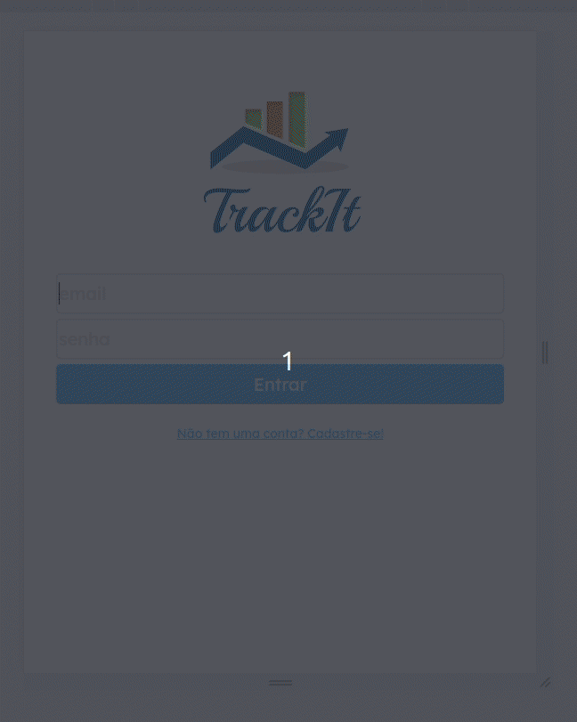

# Track It

An easy to use habit manager. create new habits and manage their frequency, delete old habits, see your completes habits every day.



Try it out now at https://trackit-6xt99eubn-lucasfranchini.vercel.app

## About

This is an web application with which lots of people can manage their own expenses and revenues. Below are the implemented features:

- Sign Up
- Login
- List all habits for a user
- Add habit
- delete habit
- show all complete habits in a day
- show best complete days sequence of a habit
- show current complete days sequence of a habit
- show old days with complete habits or uncomplete habits
- responsive layout


this application uses a third party API made by RespondeAi for database and back-end requests.

By using this app any user can manage their daily routine, and see how they mantain their habits.

## Technologies
The following tools and frameworks were used in the construction of the project:<br>
<p>
  
  
  
  
</p>

## How to run
1. Clone this repository
2. Install dependencies
```bash
npm i
```
3. create .env with:
```
REACT_APP_API_BASE_URL=https://mock-api.bootcamp.respondeai.com.br/api/v2/trackit
```
4. Run the front-end with
```bash
npm start
```
5. You can optionally build the project running
```bash
npm run build
```
6. Finally access http://localhost:3000 on your browser 
